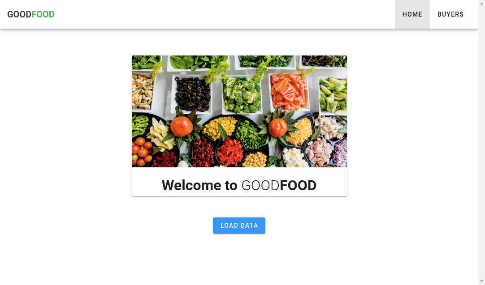
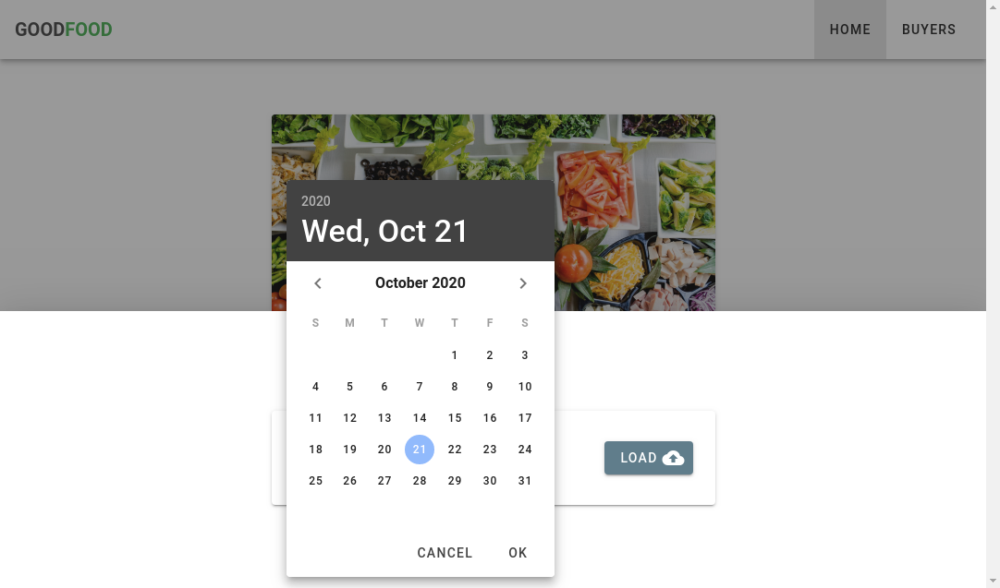
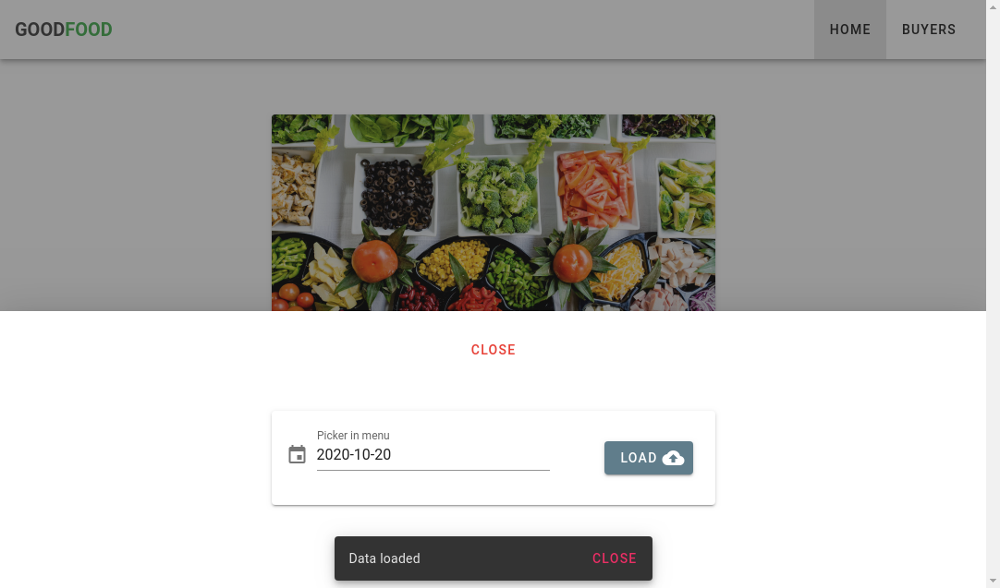
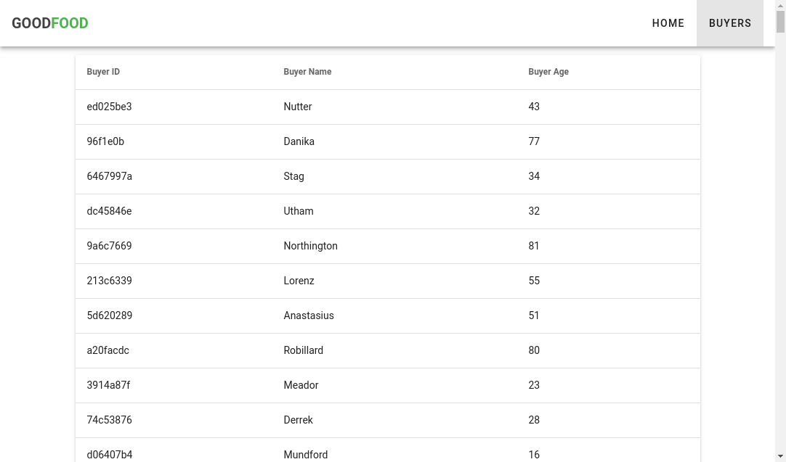
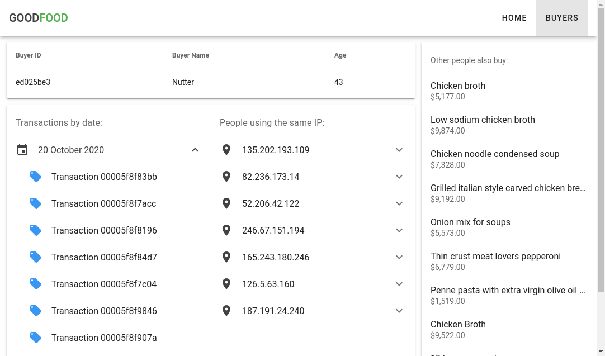

# GOODFOOD

Visualizer of clients and transactions

This repository contains code for the web interface of GOODFOOD application. [In this link you can see code for backend](https://github.com/rubbenpad/gofood)

## Requirements:

1. Get data from external sources and format it to store in a graph-based database

    - Products
    - Clients
    - Transactions

2. List all clients of the platform

3. Get information about a specific client by his ID

    - Transactions history
    - Other clients using the same IP
    - Recommendations about products that other people also buy

4. Create a web interface to visualize the data

    - Select a date to load data from
    - List all clients
    - See information about specific client

## How the application looks like

### Home

### Load data section

This section allows you to select a date from which you want to load the data. By default the application load data for the current day.

When the process to load data have finish you can see the message according the case. "Data loaded" for successful response.

### Buyers List

Here you can see the list of all buyers in the platform. If you click over a item the application show the page of buyer detail.

### Buyer detail

This page show the detail of a buyer and his transactions history. Also you can see a list of IP's used by the buyer and a sub-list of people that make transactions from the same IP. In the right side of the page you can see a list of top 10 products recommended to the current client in based of people that buy similar products.

## Technologies:

-   [Go](https://golang.org)
-   [Chi Router](https://github.com/go-chi/chi)
-   [DGraph](https://dgraph.io)
-   [Vue](https://vuejs.org) and [Vuetify](https://vuetifyjs.com)

## Quick start:

1. Clone this repository:

    `git clone git@github.com:rubbenpad/vuefood.git`

2. Navigate into your new folder and install dependencies:

    `cd vuefood`

    `npm install`

3. Compiles and hot-reloads for development

    `npm run serve`

4. Compiles and minifes for production

    `npm run build`

5. Lint and fixes files

    `npm run lint`
